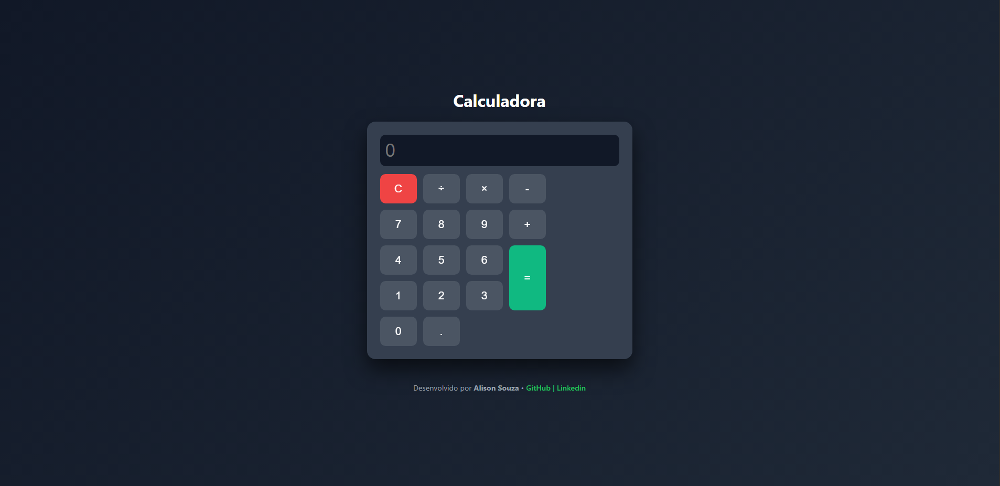

# 🧮 Calculadora Online Moderna


## 💻 Preview



Uma calculadora web com design moderno e minimalista, desenvolvida para oferecer uma experiência de usuário fluida. O projeto utiliza **Glassmorphism** e efeitos de gradiente para uma interface elegante e profissional.

---

## 🚀 Tecnologias

Este projeto foi desenvolvido utilizando as tecnologias fundamentais da web:

- **HTML5:** Estruturação semântica.
- **CSS3:** Estilização avançada (CSS Grid, Flexbox, Gradients e Transitions).
- **JavaScript (ES6+):** Lógica de processamento matemático e manipulação dinâmica do DOM.

## ✨ Funcionalidades

- [x] **Operações Básicas:** Soma, subtração, multiplicação e divisão.
- [x] **Interface Glassmorphism:** Fundo com desfoque e transparências.
- [x] **Design Responsivo:** Adaptável a diferentes tamanhos de tela.
- [x] **Feedback Visual:** Efeitos de _hover_ e _active_ nos botões.
- [x] **Tratamento de Erros:** Exibe mensagem de erro para cálculos matemáticos inválidos.

## 🛠️ Como usar o projeto

1. **Clone o repositório:**

   ```bash
   git clone [https://github.com/alison-souza/calculator.git](https://github.com/alison-souza/calculator.git)
   ```

2. **Abra o diretório**

   ```bash
    cd calculator
   ```

3. **Inicie o arquivo: Basta abrir o arquivo index.html em qualquer navegador moderno.**

## 📂 Estrutura do Projeto

```text
calculator/
├── index.html
├── style.css
├── script.js
└── README.md
```
